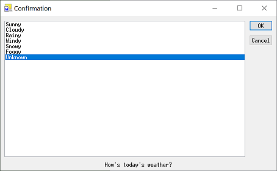

# ttpmacro

  - [ttpmacro_mod.exe](https://github.com/hkanou/ttpmacro/tree/main/ttpmacro/Release) -- listbox修正版  
    ttpmacro(teraterm-5.2)のlistboxに下記の修正を行ったものです。  
    - アイコン画像の設定  
    - ダブルクリックによる項目選択オプションの追加  
    - 最小化/最大化ボタンのオプションの追加  
    - 最小化状態での表示オプションの追加  
    - 最大化状態での表示オプションの追加  
    - ダイアログのサイズを拡大オプションの追加  
  
    [使用方法](http://htmlpreview.github.io/?https://github.com/hkanou/ttpmacro/blob/main/ttpmacro/doc/listbox.html)  
    [パッチ](https://github.com/hkanou/ttpmacro/tree/main/ttpmacro)  

    動作環境 : [Tera Term 5](https://teratermproject.github.io/)  
    

## ビルド環境

  Visual Studio Express 2017
