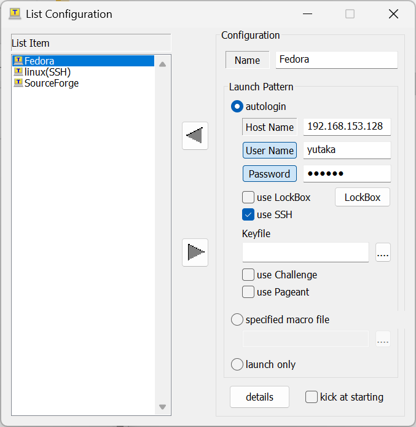
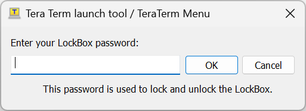

# ttpmacro

  - **listbox修正版**  
    [パッチ](https://github.com/TeraTermProject/teraterm/commit/7b3ccb4fe2999557aa7e17d6e0ceeb15156b9633)
    (動作環境 : [Tera Term 5](https://teratermproject.github.io/))

    ttpmacro(teraterm-5.2)のlistboxに下記の修正を行ったものです。  
    → Tera Termのソースにマージ頂きました。https://github.com/TeraTermProject/teraterm/pull/222

    - アイコン画像の設定
    - ダブルクリックによる項目選択オプションの追加
    - 最小化/最大化ボタンオプション追加
    - 最小化状態表示オプション追加
    - 最大化状態表示オプション追加
    - ダイアログサイズ指定オプションの追加
  
  - **setpassword、getpassword暗号化機能追加版**  
    [パッチ](https://github.com/TeraTermProject/teraterm/commit/e7d5453bfb6813567b24d90692b79e4c0060949a)
    (動作環境 : [Tera Term 5](https://teratermproject.github.io/))

    ttpmacro(teraterm-5.2)のsetpassword、getpasswordのパスワードをAES-256-CTRで暗号化/復号するためのパッチです。  
    → Tera Termのソースにマージ頂きました。https://github.com/TeraTermProject/teraterm/pull/211

  - **ファイル操作コマンド暗号化機能追加版**  
    [パッチ](https://github.com/hkanou/ttpmacro/tree/main/ttpmacro3)
    (動作環境 : [Tera Term 5](https://teratermproject.github.io/))
  
    **<ins>※ 試作中</ins>**  
  
    暗号化されたファイルの読み書き等を可能とするパッチです。  
    
    filecreate \<file handle\> \<filename\> **<ins>['password=abcd']</ins>**  
    fileopen \<file handle\> \<filename\> \<append flag\> [\<readonly flag\>] **<ins>['password=abcd']</ins>**  
    fileconcat \<file1\> \<file2\> **<ins>['password1=abcd'] ['password2=abcd']</ins>**  
    filetruncate \<filename\> \<size\> **<ins>['password=abcd']</ins>**  
    
    下記のコマンドが暗号化機能対応になります。  
  
    fileread  
    filereadln  
    filewrite  
    filewriteln  
    fileseek  
    fileseekback  
    filemarkptr  
    filestrseek  
    filestrseek2  
    fileclose  

  - **ttpmacro : VT window のテキスト領域の位置、サイズ、最小化状態を取得する getttpos コマンド追加版**  
    [パッチ](https://github.com/TeraTermProject/teraterm/pull/269/files)
    (動作環境 : [Tera Term 5.2 dev 609f1b96 以降](https://ci.appveyor.com/project/teraterm/github-main/builds/50251240/artifacts))  
  
    VT window のテキスト領域の位置やサイズを取得する getttpos コマンドを追加するパッチです。  
    → Tera Termのソースにマージ頂きました。https://github.com/TeraTermProject/teraterm/pull/269

# ttpmenu

  - **ログインパスワードの暗号化機能(LockBox)追加版**  
    [パッチ](https://github.com/TeraTermProject/teraterm/pull/247/files)
    (動作環境 : [Tera Term 5](https://teratermproject.github.io/))

    ログインパスワードをAES-256-CTRで暗号化/復号する機能(LockBox)を追加したものです。  
    → Tera Termのソースにマージ頂きました。https://github.com/TeraTermProject/teraterm/pull/247
  
      
    

# その他

  - **[Issues, Pull requests, Commits](https://github.com/search?q=author%3Ahkanou+repo%3ATeraTermProject%2Fteraterm&type=issues&s=created&o=desc)**
  - **[AppVeyor](https://ci.appveyor.com/project/hkanou/teratermproject-teraterm/history**

## ビルド環境

  Visual Studio Express 2017  
  Visual Studio Community 2022
